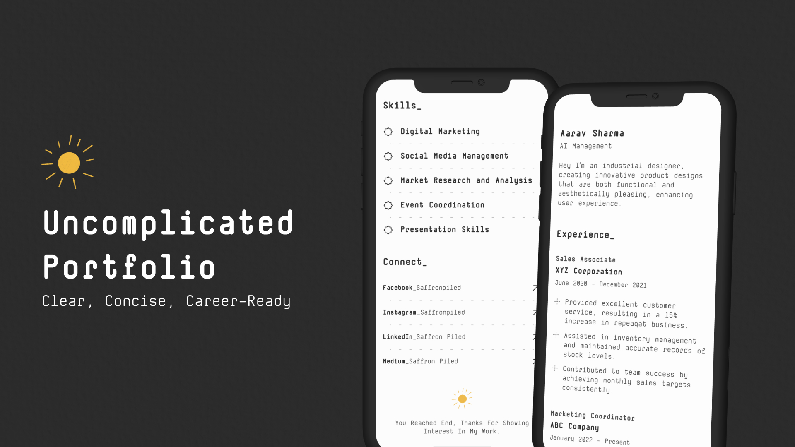

# Uncomplicated Portfolio ([Live](https://uncomplicated-portfolio.vercel.app/))

A minimalist portfolio website created with Next.js and TailwindCSS.



## Getting Started

1. Clone the repository and navigate to the project directory

```bash
git clone https://github.com/saadfrhan/uncomplicated-portfolio.git
cd uncomplicated-portfolio
```

1. Install the dependencies

```bash
pnpm install
```

1. Run the project

```bash
pnpm dev
```

1. Navigate to [localhost:3000](http://localhost:3000) in your browser to see the project.

## 🤝 Contributing

Contributions are what make the open source community such an amazing place to learn, inspire, and create. Any contributions you make are greatly appreciated. Star the project if you like it.

- Fork the Project
- Create your Feature Branch (`git checkout -b feature/AmazingFeature`)
- Commit your Changes (`git commit -m 'Add some AmazingFeature'`)
- Push to the Branch (`git push origin feature/AmazingFeature`)
- Open a Pull Request.
